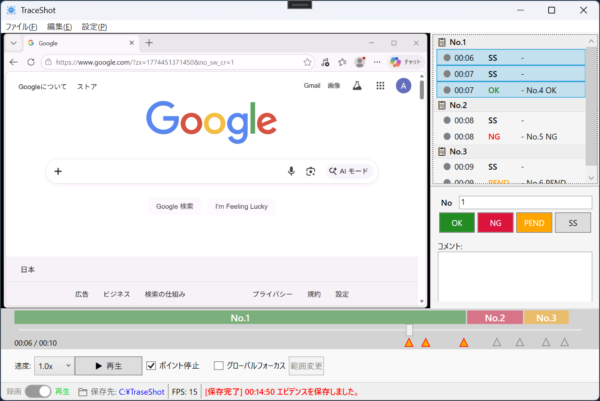
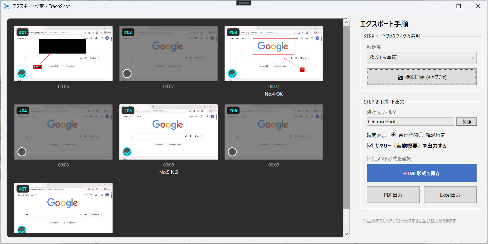

# TraceShot 📸
**「操作の軌跡を、ズレない証跡に。」**

TraceShotは、システム開発のテストエビデンス作成やバグ報告を劇的に効率化する、WPF製のアノテーション・エビデンス管理ツールです。注釈の位置を相対座標で管理するため、動画の解像度が変わっても「証跡のズレ」を許しません。

---

## ✨ 主な機能

### 1. 直感的な録画と証跡管理
シンプルなメイン画面から、画面全体や特定範囲の録画を即座に開始。気になる瞬間を「証跡（ブックマーク）」としてワンクリックでピックアップし、コメントや注釈を付加できます。座標を相対値 ($RelX, RelY$) で保持するため、再生ウィンドウをリサイズしても注釈が対象物からズレることなく追従します。

### 2. 多彩なドキュメント・エクスポート
記録した証跡は、プレビューを確認しながら **HTML、PDF、Excel** 形式で出力可能。報告書作成の手間を最小限に抑え、チームへの共有をスムーズにします。

### 3. スマートな編集体験
* **インテリジェント・コピー＆ペースト**: 注釈データを JSON 形式でクリップボードに保持。別のシーンやプロジェクトへ瞬時に複製可能です。
* **直感的な視覚フィードバック**: 
  * 選択中の注釈は太線で強調。
  * ノート選択時は **テキストが自動でボールド（太字）化** され、操作対象を一目で判別できます。
* **モダンな UI**: `Segoe MDL2 Assets` フォントによる洗練されたアイコンメニュー。

---

## ⌨️ ショートカットキー (Hotkeys)

効率的なエビデンス編集をサポートするため、以下の標準的なショートカットキーに対応しています。

| キー | 動作 | 内容 |
| :--- | :--- | :--- |
| **Ctrl + O** | 開く | エビデンスファイル (.json) を読み込みます。 |
| **Ctrl + S** | 保存 | 現在の作業内容をファイルに保存します。 |
| **Ctrl + E** | エクスポート | 証跡を各種形式で出力します。 |
| **Ctrl + C** | コピー | 選択中の注釈をクリップボードに保持します。 |
| **Ctrl + V** | 貼り付け | コピーした注釈を現在のタイムラインに複製します。 |
| **Delete** | 削除 | 現在表示されているブックマーク（証跡）を削除します。 |
| **Esc** | 解除 | 注釈の選択状態を解除します。 |

---

## 🛠 技術スタック
- **Runtime**: .NET 8
- **UI Framework**: WPF
- **Architecture**: MVVM (CommunityToolkit.Mvvm)
- **Serialization**: System.Text.Json
- **Design Assets**: Segoe MDL2 Assets

---

## 📖 詳細マニュアル
より詳しい操作方法やクイックスタートガイド、技術仕様については [Wiki](../../wiki) を参照してください。

---

## 📝 ロードマップ (Roadmap)
- [x] 相対座標による解像度追従ロジック
- [x] JSON Polymorphism による注釈の永続化
- [x] 選択状態の視覚強調 (発光・ボールド化)
- [x] キーボードショートカットの一括実装
- [ ] 矢印キーによる注釈の 1px 微調整機能
- [ ] ダークモード (Dark Theme) への対応

---

## 📄 ライセンス
MIT License
Copyright (c) 2026 atsushi-uchi

使用素材
- 効果音：[OtoLogic](https://otologic.jp/)
- その他、音源の詳細は Resources/Sounds/LICENSE_SOUNDS.txt を参照してください。
